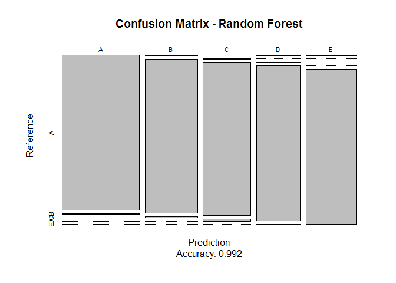
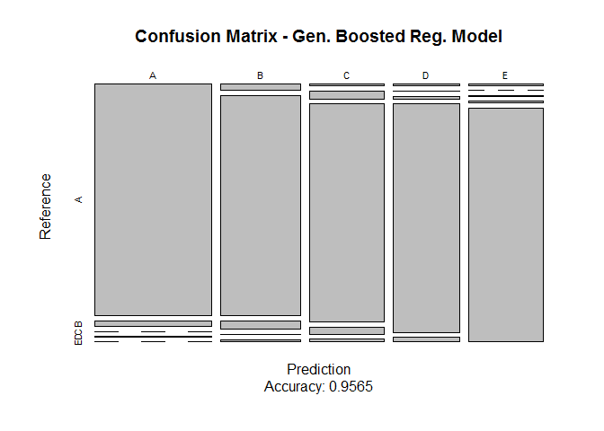

# Practical Machine Learning: Course Project
seb  
24 Oktober 2016  


## Introduction
Course Project for Coursera **Practical Machine Learning** Class.

### Background
Using devices such as *Jawbone Up*, *Nike FuelBand*, and *Fitbit* it is now possible to collect a large amount of data about personal activity relatively inexpensively. These type of devices are part of the quantified self movement - a group of enthusiasts who take measurements about themselves regularly to improve their health, to find patterns in their behavior, or because they are tech geeks. One thing that people regularly do is quantify how *much* of a particular activity they do, but they rarely quantify *how well they do it*. In this project, your goal will be to use data from accelerometers on the belt, forearm, arm, and dumbell of 6 participants. They were asked to perform barbell lifts correctly and incorrectly in 5 different ways.

### Source
Velloso, E.; Bulling, A.; Gellersen, H.; Ugulino, W.; Fuks, H. **Qualitative Activity Recognition of Weight Lifting Exercises.** *Proceedings of 4th International Conference in Cooperation with SIGCHI (Augmented Human '13)*. Stuttgart, Germany: ACM SIGCHI, 2013.

Read more: http://groupware.les.inf.puc-rio.br/har

### Goal
The goal of this project is to predict the manner in which they did the exercise. This is the "classe" variable in the training set. We may use any of the other variables to predict with. We should create a report describing how you built your model, how we used cross validation, what we think the expected out of sample error is, and why we made the choices we did. We will also use your prediction model to predict 20 different test cases at the end.

## Data Acquisition
Loading necessary libraries.

```r
library(caret)
library(randomForest)
library(gbm)
```

Getting and saving the data locally and load them into R.

```r
## load training data set
name.file.train <- "pml-training.csv"

if (!file.exists(name.file.train)) {
  fileURL <- "https://d396qusza40orc.cloudfront.net/predmachlearn/pml-training.csv"
  download.file(fileURL, name.file.train)
}  

data.train <- read.csv(name.file.train)


## load testing data set
name.file.test <- "pml-testing.csv"

if (!file.exists(name.file.test)) {
  fileURL <- "https://d396qusza40orc.cloudfront.net/predmachlearn/pml-testing.csv"
  download.file(fileURL, name.file.test)
}  

data.test <- read.csv(name.file.test)
```

## Data Cleansing
First we will split our train data into a training and a test set. The original test set will be used as a validation set.

```r
inTrain <- createDataPartition(data.train$classe, p = 0.7, list = FALSE)
training <- data.train[inTrain, ]
testing <- data.train[-inTrain, ]
```
We will remove the first seven columns as they are about the person and do not affect the class of the exercise.

```r
training <- training[,8:length(colnames(training))]
dim(training)
```

```
## [1] 13737   153
```
Next we will remove Columns which show nearly no or not any variance, as they are useless to be used for predictions.

```r
NZV.Columns <- nearZeroVar(training)
training <- training[, -NZV.Columns]
dim(training)
```

```
## [1] 13737   102
```
Furthermore we are removing columns which are more than 80% empty as they do not help us much.

```r
NA.NumberOfNAs <- sapply(training, function(x) sum(is.na(x)))
NA.ColumnsToRemove <- names(NA.NumberOfNAs[NA.NumberOfNAs/dim(training)[1] > 0.8])
training <- training[ , !names(training) %in% NA.ColumnsToRemove]
dim(training)
```

```
## [1] 13737    53
```
Finally, we apply the same to the test data sets as we only need the same columns.

```r
Columns.Remaining <- colnames(training)
testing <- testing[, Columns.Remaining]
dim(testing)
```

```
## [1] 5885   53
```

```r
data.test <- data.test[, Columns.Remaining[-length(Columns.Remaining)]]
dim(data.test)
```

```
## [1] 20 52
```

## Prediction: Random Forests

```r
model.rf <- train(classe ~ .,
                  data = training,
                  method="rf",
                  trControl = trainControl(method = "cv", 5))

prediction.rf <- predict(model.rf, newdata = testing)

cfMatrix.rf <- confusionMatrix(prediction.rf, testing$classe)
cfMatrix.rf
```

```
## Confusion Matrix and Statistics
## 
##           Reference
## Prediction    A    B    C    D    E
##          A 1670    9    0    0    0
##          B    2 1125    9    0    0
##          C    0    5 1015   16    0
##          D    1    0    2  948    2
##          E    1    0    0    0 1080
## 
## Overall Statistics
##                                           
##                Accuracy : 0.992           
##                  95% CI : (0.9894, 0.9941)
##     No Information Rate : 0.2845          
##     P-Value [Acc > NIR] : < 2.2e-16       
##                                           
##                   Kappa : 0.9899          
##  Mcnemar's Test P-Value : NA              
## 
## Statistics by Class:
## 
##                      Class: A Class: B Class: C Class: D Class: E
## Sensitivity            0.9976   0.9877   0.9893   0.9834   0.9982
## Specificity            0.9979   0.9977   0.9957   0.9990   0.9998
## Pos Pred Value         0.9946   0.9903   0.9797   0.9948   0.9991
## Neg Pred Value         0.9990   0.9971   0.9977   0.9968   0.9996
## Prevalence             0.2845   0.1935   0.1743   0.1638   0.1839
## Detection Rate         0.2838   0.1912   0.1725   0.1611   0.1835
## Detection Prevalence   0.2853   0.1930   0.1760   0.1619   0.1837
## Balanced Accuracy      0.9977   0.9927   0.9925   0.9912   0.9990
```


```r
plot(cfMatrix.rf$table,
     main = "Confusion Matrix - Random Forest",
     sub = paste0("Accuracy: ", round(cfMatrix.rf$overall['Accuracy'], 4)))
```

<!-- -->

## Prediction: Generalized Boosted Regression Model

```r
model.gbm <- train(classe ~ .,
                  data = training,
                  method="gbm",
                  trControl = trainControl(method = "cv", 5),
                  verbose = FALSE)
```

```
## Loading required package: plyr
```

```r
prediction.gbm <- predict(model.gbm, newdata = testing)

cfMatrix.gbm <- confusionMatrix(prediction.gbm, testing$classe)
cfMatrix.gbm
```

```
## Confusion Matrix and Statistics
## 
##           Reference
## Prediction    A    B    C    D    E
##          A 1627   39    0    2    0
##          B   30 1064   39    2   10
##          C    7   35  974   30   12
##          D    5    1   11  922   18
##          E    5    0    2    8 1042
## 
## Overall Statistics
##                                          
##                Accuracy : 0.9565         
##                  95% CI : (0.951, 0.9616)
##     No Information Rate : 0.2845         
##     P-Value [Acc > NIR] : < 2.2e-16      
##                                          
##                   Kappa : 0.945          
##  Mcnemar's Test P-Value : 2.36e-06       
## 
## Statistics by Class:
## 
##                      Class: A Class: B Class: C Class: D Class: E
## Sensitivity            0.9719   0.9342   0.9493   0.9564   0.9630
## Specificity            0.9903   0.9829   0.9827   0.9929   0.9969
## Pos Pred Value         0.9754   0.9293   0.9206   0.9634   0.9858
## Neg Pred Value         0.9889   0.9842   0.9892   0.9915   0.9917
## Prevalence             0.2845   0.1935   0.1743   0.1638   0.1839
## Detection Rate         0.2765   0.1808   0.1655   0.1567   0.1771
## Detection Prevalence   0.2834   0.1946   0.1798   0.1626   0.1796
## Balanced Accuracy      0.9811   0.9585   0.9660   0.9747   0.9800
```


```r
plot(cfMatrix.gbm$table,
     main = "Confusion Matrix - Gen. Boosted Reg. Model",
     sub = paste0("Accuracy: ", round(cfMatrix.gbm$overall['Accuracy'], 4)))
```

<!-- -->

## Results
Finally, we can predict the test data set with our choosen model, which is the **random forests** in our case as it showed a higher accuracy.

```r
prediction.test <- predict(model.rf, newdata = data.test)
prediction.test
```

```
##  [1] B A B A A E D B A A B C B A E E A B B B
## Levels: A B C D E
```


```r
sample.error <- 1 - cfMatrix.rf$overall['Accuracy']
sample.error
```

```
##    Accuracy 
## 0.007986406
```
The out of sample error is usually bigger than the in-sample error. Therefore it can be assumed that it will be (slightly) bigger than **0.0079864%**.
